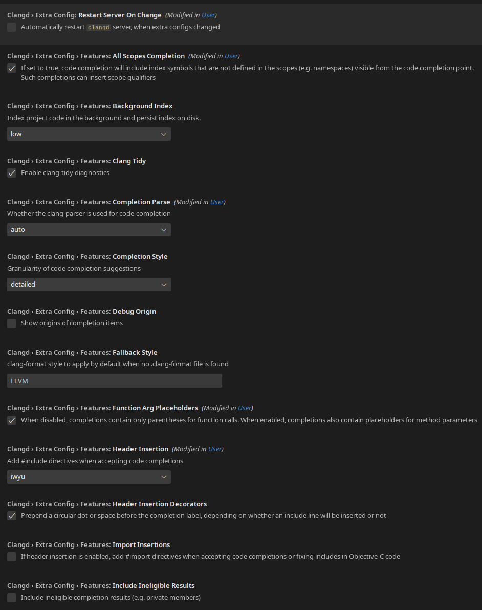
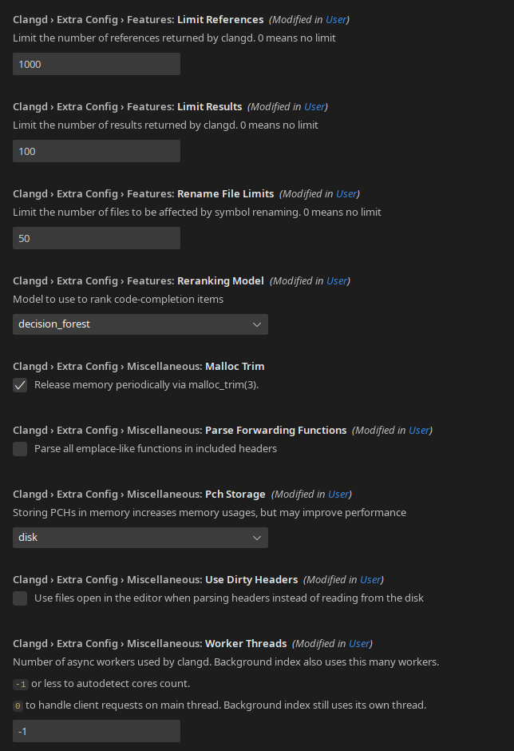

# Adds extra configurations for the clangd server.

This extension adds more configuration options, what by default can be configured via command line arguments.

**This extension modifies the workspace clangd server arguments to handle this extra configuration.**

